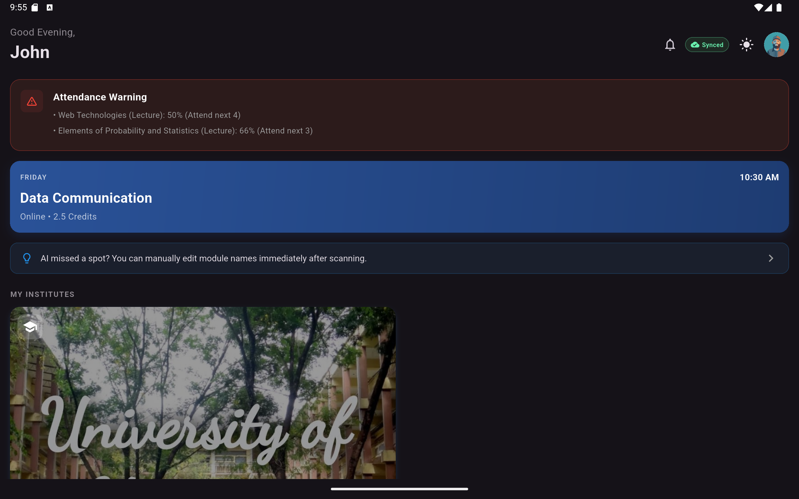
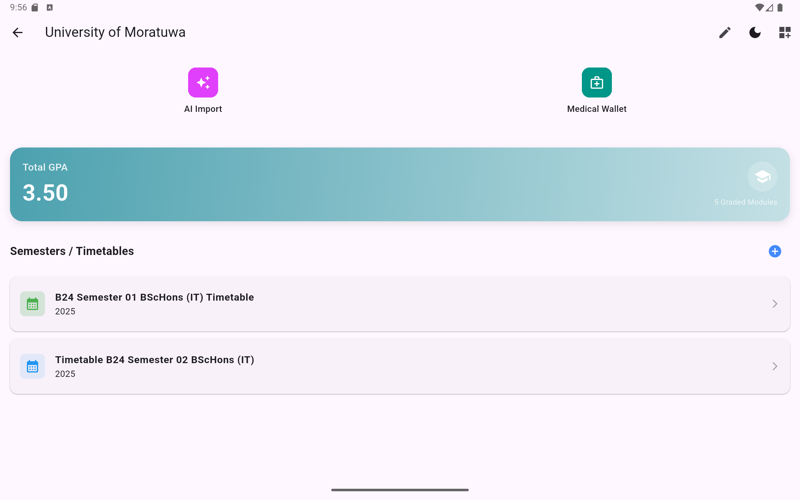
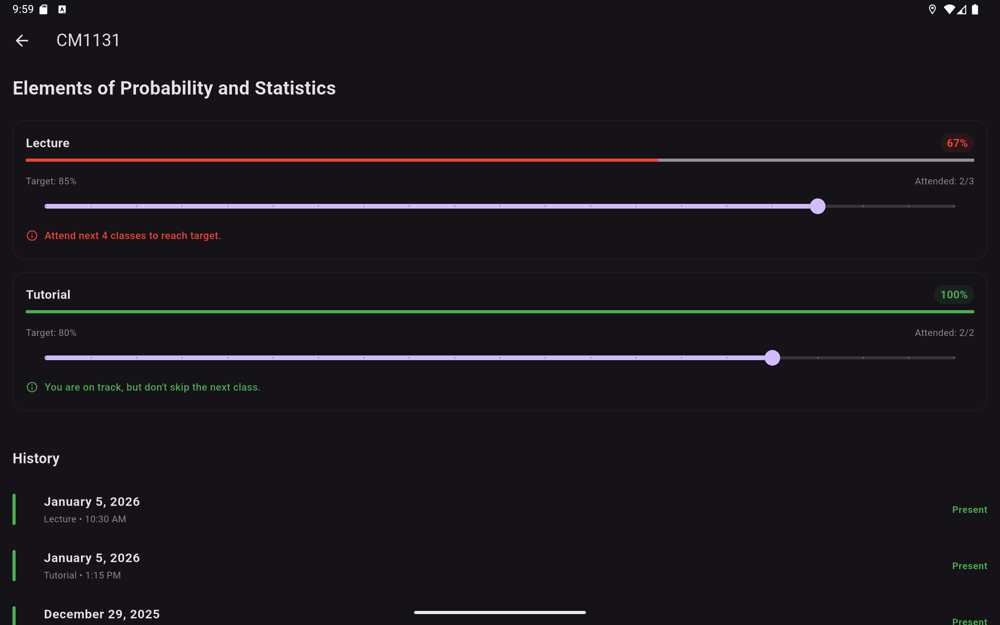
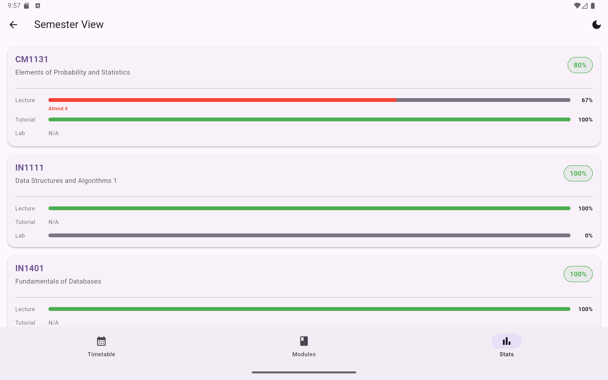
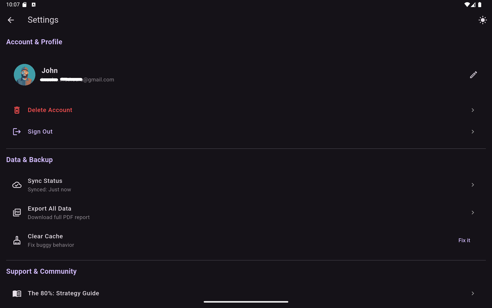

# Attendance Tracker

  

A powerful, cross-platform Flutter application designed to help university students manage their timetables, track attendance, and stay organized with AI-powered automation.

  

## 🌐 Live Demo

  

Experience the app directly in your browser:

*   **Live Web App**: [Click Here](https://attendance-tracker-5d550.web.app)

*   **Demo Repository**: [View Source](https://github.com/inusha-thathsara/attendance-tracker-demo/tree/main)

*   [](https://inusha-gunasekara.hashnode.dev/how-i-built-a-flutter-gemini-ai-app-to-hack-my-university-attendance-open-source)

  

## 🚀 Features

  

### 📅 Smart Timetable Management

*   **Multiple Timetables**: Manage schedules for different semesters or exam periods.

*   **Active Focus**: The module list automatically filters to show only modules relevant to your currently active timetable, keeping your view clutter-free.

*   **Shared Modules**: Modules can exist across multiple timetables (e.g., repeating courses), with updates synced everywhere.

*   **Structured Data**: Strict module-first architecture ensures data integrity—classes must be linked to valid modules.

*   **Flexible Entries**: Support for Lectures, Tutorials, and Labs with custom locations and modes (Online/In-person).

*   **Cascading Delete**: Deleting a module automatically cleans up all associated classes to keep your schedule clutter-free.

*   **Calendar View**: Switch between a weekly list and a monthly calendar view to visualize your schedule.

  

### 🤖 AI-Powered Automation

*   **PDF Import**: Upload your official university timetable PDF and let **Google Gemini AI** automatically extract and set up your schedule in seconds.

*   **Multi-API Key Support**: Configure multiple Gemini API keys to handle rate limits and ensure uninterrupted parsing.

*   **Smart Parsing**: Intelligently identifies subject names, times, and class types.

  

### 🔔 Intelligent Notifications

*   **Timezone Aware**: Notifications are scheduled based on your **local device time**, ensuring you get alerts even if you travel.

*   **Pre-Class Alerts**: Get notified 10 minutes before every class so you're never late.

  

### ✅ Attendance Tracking

*   **Status Options**: Mark classes as **Present**, **Absent**, or **Cancelled**.

*   **Conflict Detection**: Automatically detects and warns about overlapping classes when adding or editing entries.

*   **Restricted Marking**: Prevents marking attendance for future classes or dates outside the timetable.

*   **Visual Stats**: View attendance percentages for each module to ensure you meet university requirements.

*   **Danger Zone Planner**: Advanced "Safe to Skip" calculator with granular control. Set specific targets for different session types (e.g., maintain 80% for Labs but 70% for Lectures) and see exactly how many classes you can miss.

*   **Smart History**: View detailed attendance logs, automatically filtered to show only relevant dates for the current semester.

  

### 🎨 User Experience

*   **Accordion Modules**: Organize your modules by semester with a buttery-smooth, animated accordion view.

*   **Total Credits Display**: Instantly see the total credits for each semester or timetable at a glance.

*   **Avatar Customization**: Personalize your profile with a selection of built-in avatars, synced across all your devices.

*   **Sender-Controlled Privacy**: Share timetables via ephemeral QR codes. The shared link is active **only while you keep the dialog open**. Closing it instantly invalidates the link, giving you full control over your data.

*   **Dark/Light Mode**: Fully supported themes that adapt to your system settings or manual preference.

*   **Offline Support**: Built with **offline-first** architecture. View and edit your data without internet; changes sync automatically when you reconnect.

*   **Secure Auth**: Cloud-based user authentication via Firebase.

*   **Multi-Account Login**: Seamlessly switch between multiple accounts with **one-tap login**. Credentials are securely encrypted and stored on-device.

*   **Username Safety**: Intelligent profanity filtering prevents the creation of accounts with offensive usernames, ensuring a safe community environment.

  

## 🛠️ Tech Stack

  

*   **Framework**: [Flutter](https://flutter.dev/) Flutter (Dart) - 11,000+ lines of code, 98% Dart

*   **Backend**: [Firebase](https://firebase.google.com/)

    *   **Firestore**: Real-time NoSQL database with offline persistence.

    *   **Authentication**: Secure email/password login.

*   **AI Integration**: [Google Gemini API](https://ai.google.dev/)

*   **State Management**: [Provider](https://pub.dev/packages/provider)

*   **Local Storage**: `shared_preferences` for settings, `flutter_secure_storage` for encrypted credentials.

*   **Security**: `profanity_filter` for content moderation.

*   **Notifications**: `flutter_local_notifications` & `flutter_timezone`.

  

## 📱 Getting Started

  

### Prerequisites

*   Flutter SDK (v3.0+)

*   Firebase Project (Auth & Firestore enabled)

*   Google Gemini API Key (Optional - for AI features)

  

### Installation

  

1.  **Clone the repository**:

    ```bash

    git clone https://github.com/inusha-thathsara/attendance-tracker-demo.git

    cd attendance-tracker-demo

    ```

  

2.  **Install Dependencies**:

    ```bash

    flutter pub get

    ```

  

3.  **Firebase Setup**:

    *   Create a project in [Firebase Console](https://console.firebase.google.com/).

    *   Add Android/iOS apps and download `google-services.json` / `GoogleService-Info.plist`.

    *   Place config files in `android/app/` and `ios/Runner/` respectively.

  

4.  **Run the App**:

    ```bash

    flutter run

    ```

  

## 💡 Feedback & Resources

  

*   **Feature Requests**: Have an idea to make the app better? [Submit a Request](https://docs.google.com/forms/d/e/1FAIpQLSfWUjWJU2UtxzCvJFHtAFMJTe5-4kLuBr0otiVv3oQ-omp27g/viewform)

*   **Strategy Guide**: Learn how to optimize your attendance with [The 80% Strategy Guide](https://hill-grenadilla-8a4.notion.site/The-80-Attendance-Strategy-for-Undergrads-2d4d8852a123808c900cd5c78f7de104?pvs=74)

  
  

## 📸 Screenshots

  

| Login | Dashboard |

|:---:|:---:|

|  |  |

  

| Institutes | Module Details |

|:---:|:---:|

|  |  |

  

| Stats | Settings |

|:---:|:---:|

|  |  |

  

## 📄 License

  

This project is licensed under the MIT License.
