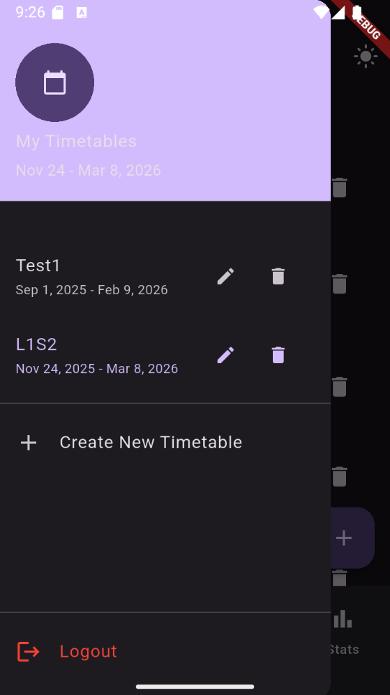
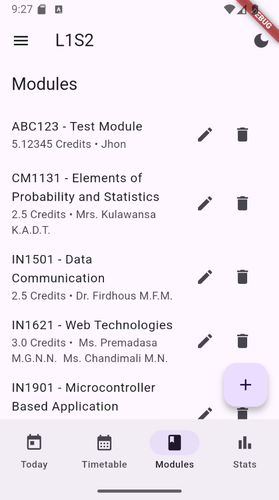
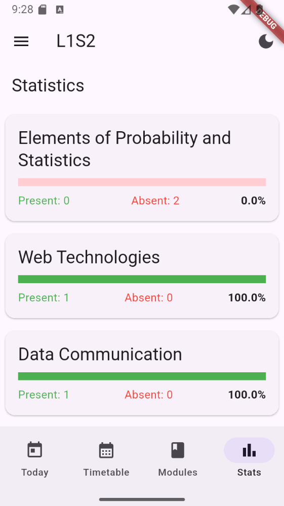
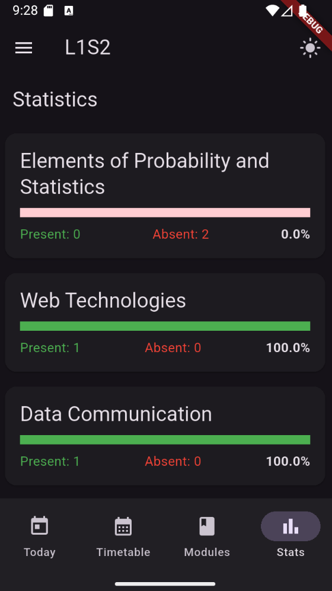
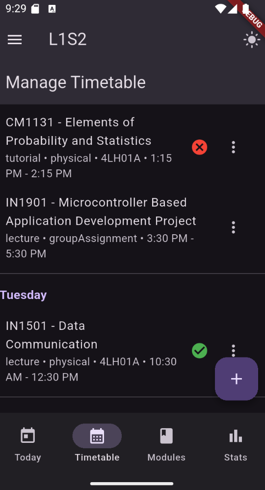

# Attendance Tracker

A powerful, cross-platform Flutter application designed to help university students manage their timetables, track attendance, and stay organized with AI-powered automation.

## 🚀 Features

### 📅 Smart Timetable Management
*   **Multiple Timetables**: Manage schedules for different semesters or exam periods.
*   **Flexible Entries**: Support for Lectures, Tutorials, and Labs with custom locations and modes (Online/In-person).
*   **Cascading Delete**: Deleting a module automatically cleans up all associated classes to keep your schedule clutter-free.
*   **Calendar View**: Switch between a weekly list and a monthly calendar view to visualize your schedule.

### 🤖 AI-Powered Automation
*   **PDF Import**: Upload your official university timetable PDF and let **Google Gemini AI** automatically extract and set up your schedule in seconds.
*   **Smart Parsing**: Intelligently identifies subject names, times, and class types.

### 🔔 Intelligent Notifications
*   **Timezone Aware**: Notifications are scheduled based on your **local device time**, ensuring you get alerts even if you travel.
*   **Pre-Class Alerts**: Get notified 10 minutes before every class so you're never late.

### ✅ Attendance Tracking
*   **Status Options**: Mark classes as **Present**, **Absent**, or **Cancelled**.
*   **Conflict Detection**: Automatically detects and warns about overlapping classes when adding or editing entries.
*   **Restricted Marking**: Prevents marking attendance for dates outside the current timetable's duration.
*   **Visual Stats**: View attendance percentages for each module to ensure you meet university requirements.
*   **Safe to Skip Calculator**: Set your target percentage (e.g., 80%) and instantly see how many classes you can safely miss or need to attend.
*   **Smart History**: View detailed attendance logs, automatically filtered to show only relevant dates for the current semester.

### 🎨 User Experience
*   **Accordion Modules**: Organize your modules by semester with a buttery-smooth, animated accordion view.
*   **Dark/Light Mode**: Fully supported themes that adapt to your system settings or manual preference.
*   **Offline Support**: Built with **offline-first** architecture. View and edit your data without internet; changes sync automatically when you reconnect.
*   **Secure Auth**: Cloud-based user authentication via Firebase.

## 🛠️ Tech Stack

*   **Framework**: [Flutter](https://flutter.dev/) (Dart)
*   **Backend**: [Firebase](https://firebase.google.com/)
    *   **Firestore**: Real-time NoSQL database with offline persistence.
    *   **Authentication**: Secure email/password login.
*   **AI Integration**: [Google Gemini API](https://ai.google.dev/)
*   **State Management**: [Provider](https://pub.dev/packages/provider)
*   **Local Storage**: `shared_preferences` for settings.
*   **Notifications**: `flutter_local_notifications` & `flutter_timezone`.

## 📱 Getting Started

### Prerequisites
*   Flutter SDK (v3.0+)
*   Firebase Project (Auth & Firestore enabled)
*   Google Gemini API Key (for AI features)

### Installation

1.  **Clone the repository**:
    ```bash
    git clone https://github.com/inusha-thathsara/attendance-tracker.git
    cd attendance_tracker
    ```

2.  **Install Dependencies**:
    ```bash
    flutter pub get
    ```

3.  **Firebase Setup**:
    *   Create a project in [Firebase Console](https://console.firebase.google.com/).
    *   Add Android/iOS apps and download `google-services.json` / `GoogleService-Info.plist`.
    *   Place config files in `android/app/` and `ios/Runner/` respectively.

4.  **Run the App**:
    ```bash
    flutter run
    ```

## 📸 Screenshots







## 📄 License

This project is licensed under the MIT License.
